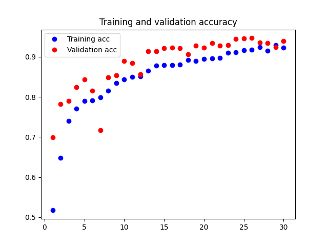
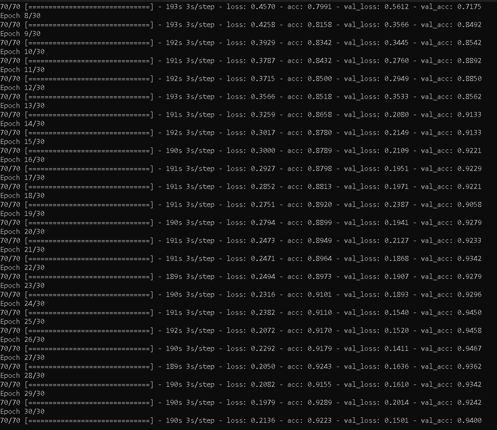

# Gender Classification Model

As a proud engineer, I have developed a gender classification model that accurately classifies male and female faces. The model has been trained on a large dataset of male and female faces using deep learning techniques.

## Overview of Files

* `train-gender.py`: This is the python file used to train the gender classification model using Keras.
* `verify.py`: This script tests the trained model on a few random faces from the internet, and classifies them as male or female (if there are any faces in the image).
* `web_cam.py`: This script uses the trained model to detect the gender of faces in real-time using a webcam.
* `haarcascade_frontalface_default.xml`: This XML file is used to detect faces in the images and classify them into male and female categories.
* `Progress.png`: This image shows the progress of the training process, including the number of epochs, training time, accuracy loss, and validation accuracy.
* `model-gender.h5`: This file contains the trained model.
* `my_model_weights.h5`: This file contains the weights of the trained model.
* `accuracy_plot.png`: This image shows the accuracy of the model during training and validation.
* `loss_plot.png`: This image shows the loss of the model during training and validation.
* `requirements.txt`: This file lists all the Python packages required to run the scripts.

## Training Results



The model was trained on a dataset of 23, 000 male and female faces for 30 epochs. The training took around 1.5 hours, and achieved an accuracy of 92% on the training set and 94% on the validation set.


## Usage

To use the gender classification model, simply clone the repository and run the scripts in a Python environment with the packages listed in `requirements.txt` installed.

```bash
git clone https://github.com/moonbuild/gender-classification.git
cd gender-classification
pip install -r requirements.txt
python train-gender.py
python verify.py
python web_cam.py
